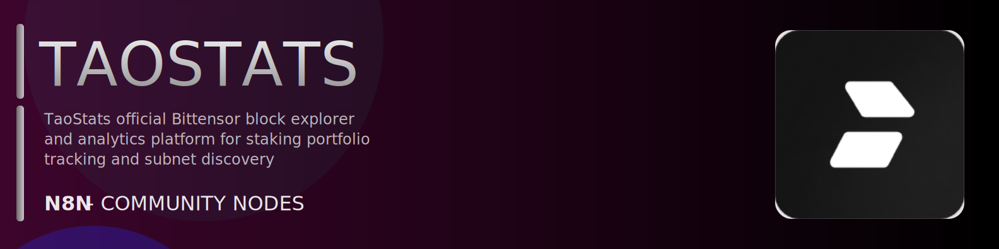

# @n8n-dev/n8n-nodes-taostats



[](https://www.npmjs.com/package/@n8n-dev/n8n-nodes-taostats)
[](https://opensource.org/licenses/MIT)

---

**Stop writing taostats API integrations by hand.**

Every time you connect n8n to taostats, you waste hours mapping endpoints, defining parameters, and debugging schemas. You copy-paste from docs, fix edge cases, and pray nothing breaks.

**What if connecting n8n to taostats took 5 minutes, not half a day?**

This node gives you **40+ resources** out of the box: **Account**, **Accounting**, **Block**, **Call**, **Coingecko**, and 35 more: with full CRUD operations, typed parameters, and zero manual configuration.

---

## What You Get

- **Zero boilerplate**: Resources, operations, and fields are pre-configured and ready to use
- **Full CRUD**: Create, read, update, and delete support where the API allows it
- **Typed parameters**: No more guessing field types
- **Built-in auth**: API key authentication, ready to go
- **Declarative**: Native n8n performance, no custom execute() overhead

---

## Install

```bash
npm install @n8n-dev/n8n-nodes-taostats
```

**Or in n8n:**
1. **Settings → Community Nodes → Install**
2. Search: `@n8n-dev/n8n-nodes-taostats`
3. Click **Install**

---

## Quick Start

1. Install the node (above)
2. Add credentials: **taostats API** → paste your API key
3. Drag the **taostats** node into your workflow
4. Pick a resource → pick an operation → done.

That's it. No configuration files. No code. It just works.

---

## Resources

<details>
<summary><b>Account</b> (1 operations)</summary>

- Get v1

</details>

<details>
<summary><b>Accounting</b> (1 operations)</summary>

- Get v1

</details>

<details>
<summary><b>Block</b> (1 operations)</summary>

- Get v1

</details>

<details>
<summary><b>Call</b> (1 operations)</summary>

- Get v1

</details>

<details>
<summary><b>Coingecko</b> (1 operations)</summary>

- Get v1

</details>

<details>
<summary><b>Delegation</b> (1 operations)</summary>

- Get v1

</details>

<details>
<summary><b>Dev Activity</b> (1 operations)</summary>

- Get v1

</details>

<details>
<summary><b>Dev Changelog</b> (1 operations)</summary>

- Get Changelog

</details>

<details>
<summary><b>Dtao</b> (1 operations)</summary>

- Get v1

</details>

<details>
<summary><b>Erc 20</b> (1 operations)</summary>

- Get v1

</details>

<details>
<summary><b>Conviction</b> (1 operations)</summary>

- Get v1

</details>

<details>
<summary><b>Contract Event</b> (1 operations)</summary>

- Get v1

</details>

<details>
<summary><b>Event</b> (1 operations)</summary>

- Get v1

</details>

<details>
<summary><b>Evm</b> (1 operations)</summary>

- Get v1

</details>

<details>
<summary><b>Exchange</b> (1 operations)</summary>

- Get v1

</details>

<details>
<summary><b>Hotkey</b> (1 operations)</summary>

- Get v1

</details>

<details>
<summary><b>Identity</b> (1 operations)</summary>

- Get v1

</details>

<details>
<summary><b>Liquidity</b> (1 operations)</summary>

- Get v1

</details>

<details>
<summary><b>Pool</b> (1 operations)</summary>

- Get v1

</details>

<details>
<summary><b>Trades</b> (1 operations)</summary>

- Get v1

</details>

<details>
<summary><b>Metagraph</b> (1 operations)</summary>

- Get v1

</details>

<details>
<summary><b>Validator</b> (3 operations)</summary>

- Get v1
- Post v1 Post
- Get v2

</details>

<details>
<summary><b>Extrinsic</b> (1 operations)</summary>

- Get v1

</details>

<details>
<summary><b>Miner</b> (1 operations)</summary>

- Get v1

</details>

<details>
<summary><b>Network Parameter</b> (1 operations)</summary>

- Get v1

</details>

<details>
<summary><b>Neuron</b> (1 operations)</summary>

- Get v1

</details>

<details>
<summary><b>Otc</b> (2 operations)</summary>

- Get v1
- Get v2

</details>

<details>
<summary><b>Coldkey Swap</b> (1 operations)</summary>

- Get v1

</details>

<details>
<summary><b>Price</b> (1 operations)</summary>

- Get v1

</details>

<details>
<summary><b>Proxy Call</b> (1 operations)</summary>

- Get v1

</details>

<details>
<summary><b>Live</b> (14 operations)</summary>

- Get Account Balance Info
- Get Block Get Range
- Get Block Get Head
- Get Block Get By Height
- Get Block Raw Get By Height
- Get Extrinsic Get By Block And Index
- Get Pool Get
- Get Version Info
- Get Const Get All
- Get Const Get By ID
- Get Event Get All
- Get Event Get By ID
- Get Storage Get All
- Get Storage Get By ID

</details>

<details>
<summary><b>RPC</b> (2 operations)</summary>

- Post HTTP
- Get Ws

</details>

<details>
<summary><b>Runtime Version</b> (1 operations)</summary>

- Get v1

</details>

<details>
<summary><b>Seal Blob</b> (1 operations)</summary>

- Post v1

</details>

<details>
<summary><b>Stake Balance</b> (1 operations)</summary>

- Get v1

</details>

<details>
<summary><b>Stats</b> (1 operations)</summary>

- Get v1

</details>

<details>
<summary><b>Status</b> (1 operations)</summary>

- Get v1

</details>

<details>
<summary><b>Subnet</b> (1 operations)</summary>

- Get v1

</details>

<details>
<summary><b>Transfer</b> (1 operations)</summary>

- Get v1

</details>

---

## Why This Node?

**Without this node:**
- Hours of manual API integration
- Copy-pasting from taostats docs
- Debugging auth, pagination, error handling
- Maintaining your own client code

**With this node:**
- Install → configure → use. 5 minutes.
- Auto-generated from the official taostats OpenAPI spec
- Always up to date when the API changes
- Native n8n performance

---

## Auto-Generated
This node was auto-generated from the official **taostats** OpenAPI specification using
[@n8n-dev/n8n-openapi-node-ultimate](https://github.com/kelvinzer0/n8n-openapi-node-ultimate),
then validated against the live API so you get accurate types and real parameters, not guesswork.

When the taostats API updates, this node updates too.

---

## Support This Project

If this node saved you hours of work, consider supporting continued development, new APIs, better error handling, and faster updates.

[](https://n8n-code.github.io/membership/#/eyJ0aXRsZSI6IktlZXAgSXQgTW92aW5nIiwiZGVzYyI6Ik9uZSBkZXZlbG9wZXIgYnVpbHQgYSB0b29sIHRoYXQgYXV0by1nZW5lcmF0ZXNcbm44biBub2RlcyBmcm9tIGFueSBPcGVuQVBJIHNwZWMuXG5cbllvdXIgZG9uYXRpb24gZnVuZHMgbmV3IGZlYXR1cmVzLCBtb3JlIEFQSSBzdXBwb3J0LFxuYW5kIGJldHRlciB0b29saW5nIGZvciBldmVyeSBkZXZlbG9wZXIgYWZ0ZXIgeW91LiIsInRhcmdldCI6NTAwMCwiYWRkcmVzc2VzIjp7ImV0aGVyZXVtIjoiMHhmMDU1NWQ0MGRiRkI0ZTNCZjA3MDQ0MjgyQjc4RjJmRTFmNTFFZjcyIiwic29sYW5hIjoiNlpEVk5BYmpZZExEcXo4cGt3VUNHYllaNVV3QlFranB0QzU1Wk5vTFcybVUifSwiZGlzY29yZCI6Imh0dHBzOi8vZGlzY29yZC5nZy9wdERaOGU0aDkzIn0)

---

## License

MIT © [kelvinzer0](https://github.com/n8n-code)
